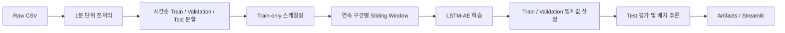

# Duksan LSTM-AE Anomaly Detection

설비의 다변량 센서 시계열을 LSTM Autoencoder로 학습하여 정상 패턴과 다른
구간을 탐지하는 프로젝트입니다. 데이터 전처리부터 학습, 임계값 산정, 평가,
배치 추론, Streamlit 시각화까지 하나의 설정 파일을 중심으로 실행할 수 있습니다.

## 주요 기능

- 5개 설비 센서의 1분 단위 다변량 시계열 처리
- 장시간 공백을 구간으로 분리하여 공백을 가로지르지 않는 슬라이딩 윈도우 생성
- 시간순 train/validation/test 분할로 미래 정보 누출 방지
- split 경계의 purge gap으로 인접 시계열 누수 방지
- train 데이터에만 설정형 scaler(`robust`, `standard`, `minmax`, `none`) fit
- STATUS 의미를 추정하지 않는 비지도 LSTM Autoencoder baseline
- train/validation percentile 또는 mean+kσ 방식의 임계값 산정
- STATUS 매핑이 명시된 경우에만 Precision, Recall, F1 등의 라벨 지표 계산
- 전체·센서별 재구성 오차를 포함한 CSV 배치 추론
- 학습 결과, 이상 점수, 임계값 및 주요 지표를 확인하는 Streamlit 대시보드
- YAML 기반 중앙 파라미터 관리

## 처리 흐름



## 프로젝트 구조

```text
.
├── app/
│   └── streamlit_app.py          # 대시보드와 실행 관리 화면
├── config/
│   └── settings.yaml             # 프로젝트 중앙 설정
├── data/
│   ├── raw/                      # 원본 데이터, Git 제외
│   └── processed/                # 전처리 데이터와 스케일러, Git 제외
├── processing/                   # 전처리 및 초기 실험용 코드
├── scripts/
│   ├── check_project.py          # 환경·데이터 구조 점검
│   ├── train.py                  # 학습 및 최초 평가
│   ├── evaluate.py               # 저장 모델 재평가
│   ├── infer.py                  # CSV 배치 추론
│   ├── run_train.sh              # Linux 학습 실행 스크립트
│   └── run_streamlit.sh          # Linux Streamlit 실행 스크립트
├── src/duksan_lstm_ae/           # 운영 파이프라인 핵심 패키지
├── tests/                         # 합성 시계열 기반 자동 검증
├── .gitignore
├── environment.yml               # Conda 환경 정의
├── Makefile                      # 주요 명령 단축 실행
├── pyproject.toml                # Python 패키지 정의
├── requirements.txt              # Python 의존성
├── README.md
└── 사용법.md                     # Linux 서버 상세 실행 안내
```

학습·평가·추론에는 `src/duksan_lstm_ae/`와 `scripts/`의 코드를 사용합니다.
`processing/`은 원본 데이터 전처리와 이전 단계 실험 코드를 보관합니다.

## 기술 스택

- Python 3.11
- PyTorch
- pandas, NumPy
- scikit-learn
- Streamlit, Plotly
- PyYAML, joblib

## 빠른 시작

### 1. Conda 환경 생성

프로젝트 루트에서 다음 명령을 실행합니다.

```bash
conda env create -f environment.yml
conda activate duksan-lstm-ae
```

환경은 현재 Linux 사용자 계정의 Conda 영역에 생성되므로 시스템 Python과
다른 사용자의 환경을 변경하지 않습니다.

환경 정의가 변경된 경우에는 다음 명령으로 갱신합니다.

```bash
conda env update -f environment.yml --prune
conda activate duksan-lstm-ae
```

### 2. 데이터 배치

원본 CSV를 다음 위치에 둡니다.

```text
data/raw/duksanind_VW_EQUIPMENT_RAW_DATA_1009.csv
```

데이터 파일과 학습 산출물은 `.gitignore`에 등록되어 저장소에 포함되지 않습니다.

### 3. 전처리

```bash
python processing/preprocess.py
```

기본 출력은 다음과 같습니다.

```text
data/processed/duksanind_VW_EQUIPMENT_PREPROCESSED.csv
data/processed/preprocessing_report.json
data/processed/segment_summary.csv
```

전처리는 시간 변환과 정렬, 설정형 중복 처리, 기준 주기 분석, 제한된 짧은 공백
보간, 장시간 공백 분리 및 `SEGMENT_ID` 생성을 수행합니다. 보간 한계의 단위는
`missing.max_interpolation_gap_steps`에 지정한 기준 주기 행(step) 수입니다.

전처리 단계에서는 scaler를 fit하지 않습니다. 이전 버전에서 만든 전체 데이터
기반 `standard_scaler.pkl`은 새 학습에 사용하지 않으므로, 변경 후에는 반드시
전처리를 다시 실행해야 합니다.

### 4. 프로젝트 점검

```bash
python scripts/check_project.py --config config/settings.yaml
```

데이터 행 수, 기간, 연속 구간, 센서 목록, PyTorch 및 CUDA 사용 가능 여부를
확인할 수 있습니다.

### 5. 모델 학습

```bash
python scripts/train.py --config config/settings.yaml
```

또는 Linux에서 다음 단축 명령을 사용할 수 있습니다.

```bash
bash scripts/run_train.sh
```

학습이 끝나면 최적 validation loss의 모델이 저장되고, 설정한 비-test 데이터
오차로 임계값을 계산한 뒤 test 데이터 탐지 결과를 저장합니다.

## 데이터 명세

전처리 및 모델 입력에 사용하는 주요 컬럼은 다음과 같습니다.

| 컬럼 | 의미 | 용도 |
|---|---|---|
| `GA_DT` | 수집 시각 | 시간 정렬 및 윈도우 종료 시각 |
| `CURRENT1` | 전류 | 모델 입력 센서 |
| `VOLTAGE` | 전압 | 모델 입력 센서 |
| `TEMP_CUR` | 온도 | 모델 입력 센서 |
| `ANALOGUE` | 진동 | 모델 입력 센서 |
| `GROUND` | 지락 | 모델 입력 센서 |
| `STATUS` | 정리된 설비 상태 | 설정이 있는 경우에만 필터·평가 메타데이터 |
| `STATUS_ORIGINAL` | 원본 설비 상태 | 원본 표현 보존 |
| `SEGMENT_ID` | 연속 수집 구간 | 장시간 공백을 넘는 윈도우 방지 |
| `INTERPOLATED_*` | 센서별 보간 마스크 | 윈도우 보간 비율 계산 |

기본 설정에서는 STATUS의 정상·이상 의미를 지정하지 않습니다. 따라서 STATUS는
모델 입력에 포함되지 않으며 학습 데이터 자동 제거에도 사용되지 않습니다.
의미가 확인된 경우에만 `status.normal_values`와 `status.anomaly_values`를
설정하십시오.

전처리 CSV를 직접 제공할 경우 최소한 `GA_DT`와 5개 센서 컬럼이 필요합니다.
`STATUS`는 선택적인 평가 메타데이터입니다. `SEGMENT_ID`가 없으면 설정한 기준
주기보다 긴 시간 공백을 기준으로 자동 생성됩니다.

## 모델 및 평가 방식

기본 윈도우 길이는 60분이며 입력 텐서 형식은 아래와 같습니다.

```text
(batch_size, sequence_length, 5 sensors)
```

LSTM Encoder가 윈도우를 latent vector로 압축하고, LSTM Decoder가 원래
시퀀스를 복원합니다. 입력과 복원값 사이의 평균제곱오차(MSE)를 이상 점수로
사용합니다.

데이터 분리와 임계값 산정 원칙은 다음과 같습니다.

1. 전체 데이터를 시간순으로 train 70%, validation 15%, test 15%로 분리
2. split 경계 다음의 설정된 행을 purge하여 경계 의존성 완화
3. train 행에만 모델용 scaler fit
4. 각 split 내부의 연속 segment에서만 윈도우 생성
5. 기본값은 모든 유효 train 윈도우를 사용하는 비지도 baseline
6. validation reconstruction error의 99.5 percentile을 기본 임계값으로 사용
7. 명시적인 STATUS 매핑과 두 클래스가 있을 때만 test 분류 지표 계산

각 윈도우는 `SEGMENT_ID` 경계 또는 1분이 아닌 시간 간격을 절대 넘지 않습니다.

## 중앙 설정

주요 파라미터는 [`config/settings.yaml`](config/settings.yaml) 한 곳에서
관리합니다.

```yaml
data:
  frequency: 1min
  duplicate_policy: mean

missing:
  max_interpolation_gap_steps: 5

status:
  use_for_training_filter: false
  normal_values: []
  anomaly_values: []

split:
  purge_gap_steps: 60

scaling:
  method: robust

window:
  sequence_length: 60
  stride: 1

model:
  hidden_size: 64
  latent_size: 16
  num_layers: 2
  dropout: 0.20

training:
  batch_size: 128
  epochs: 30
  learning_rate: 0.001
  patience: 5
  device: auto

threshold:
  method: validation_percentile
  percentile: 99.5
```

`training.device`는 `auto`, `cpu`, `cuda` 중 하나를 사용합니다. 모델 구조,
윈도우 길이 또는 입력 센서를 변경한 경우 모델을 다시 학습해야 합니다.

## 저장 모델 재평가

학습된 모델 구조와 scaler를 유지하면서 현재 설정의 임계값으로 다시 평가합니다.

```bash
python scripts/evaluate.py --config config/settings.yaml
```

## 배치 추론

현재 전처리 코드로 생성한 원래 센서 단위 CSV를 추론할 경우:

```bash
python scripts/infer.py \
  --config config/settings.yaml \
  --input data/processed/duksanind_VW_EQUIPMENT_PREPROCESSED.csv \
  --no-input-is-scaled
```

`--input-is-scaled`는 이전 버전의 전체 데이터 scaler로 변환된 파일을 임시
호환할 때만 사용합니다.

5개 센서가 원래 단위로 저장된 기준 주기 CSV를 추론할 경우:

```bash
python scripts/infer.py \
  --config config/settings.yaml \
  --input /path/to/new_sensor_data.csv \
  --no-input-is-scaled
```

상태 라벨이 없는 추론 데이터도 사용할 수 있습니다. 기본 출력 파일은 다음과
같습니다.

```text
outputs/anomaly_predictions.csv
```

출력에는 윈도우 종료 시각, 전체 이상 점수, 센서별 재구성 오차, 임계값,
비탐지·이상 탐지 결과가 포함됩니다.

## Streamlit 대시보드

```bash
bash scripts/run_streamlit.sh
```

또는:

```bash
streamlit run app/streamlit_app.py \
  --server.address 0.0.0.0 \
  --server.port 8501
```

대시보드에서 다음 항목을 확인하거나 실행할 수 있습니다.

- 학습·검증 loss
- 재구성 오차 분포와 임계값
- 시간대별 이상 점수
- STATUS 매핑이 있는 경우 혼동행렬, ROC 및 Precision-Recall 곡선
- 센서별 평균 재구성 오차
- 주요 모델·학습 파라미터 수정
- 학습, 평가 및 CSV 추론 실행 로그

Tailscale 환경에서는 브라우저에서 아래 주소로 접속합니다.

```text
http://<서버의_Tailscale_IP>:8501
```

## 학습 산출물

기본 산출물 경로는 `artifacts/lstm_ae/`입니다.

| 파일 | 내용 |
|---|---|
| `model.pt` | 모델 가중치와 학습 당시 설정 |
| `train_scaler.pkl` | train 데이터로만 학습한 scaler와 feature 순서 |
| `training_history.csv` | epoch별 train·validation loss |
| `training_metadata.json` | 분할 시각과 윈도우 수 |
| `threshold.json` | 임계값과 산정 조건 |
| `metrics.json` | test 평가 지표 |
| `evaluation_windows.csv` | test 윈도우별 점수와 예측 |
| `settings_used.yaml` | 학습에 사용한 설정 스냅샷 |

`data/`, `artifacts/`, `outputs/`, `logs/`의 실행 데이터는 Git에서 제외됩니다.
필요한 모델 파일은 서버의 접근 통제가 적용된 별도 저장소에 보관해야 합니다.

## Make 명령

```bash
make install
make preprocess
make check
make train
make evaluate
make infer
make app
make test
```

## 자동 테스트

```bash
python -m pytest -q
```

합성 시계열로 중복 정책, 짧은 결측 보간, 장기 공백 segment 분리, 공백을 넘지
않는 윈도우, train-only scaler, split 시간 비중복, feature 순서 및 모델
입출력 shape를 검증합니다.

## 운영 시 유의사항

- 시간순 분할 순서를 유지하여 학습 데이터에 미래 정보가 섞이지 않게 합니다.
- 새 설비나 센서 분포가 크게 달라지면 모델과 임계값을 다시 검증합니다.
- 임계값은 장애 누락 비용과 오탐 대응 비용을 고려해 validation 데이터에서
  조정합니다.
- 현재 도메인 정보만으로는 STATUS의 정상·장애 기준, 운전·정지·기동 상태,
  센서별 물리 정상 범위, 장애 전조 구간 및 장기 공백 원인을 확정할 수 없습니다.
- Streamlit은 분석 및 운영 지원 화면이며, 외부 공개 서비스로 사용할 경우
  별도의 인증, HTTPS, 접근 제어와 프로세스 관리 구성이 필요합니다.
- 상세한 Linux 서버 실행 순서는 [`사용법.md`](사용법.md)를 참고하십시오.
